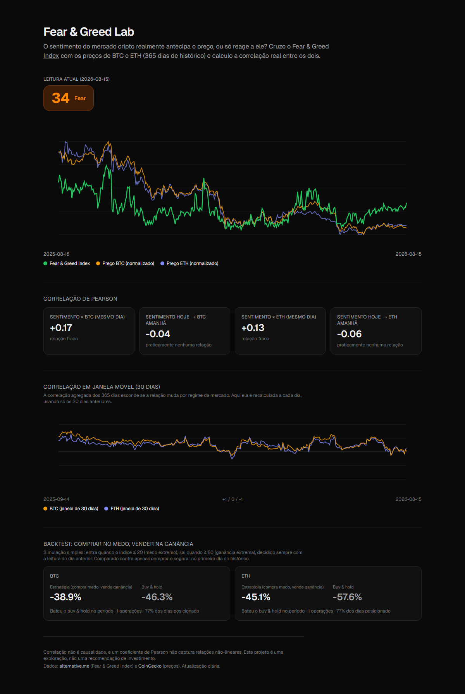
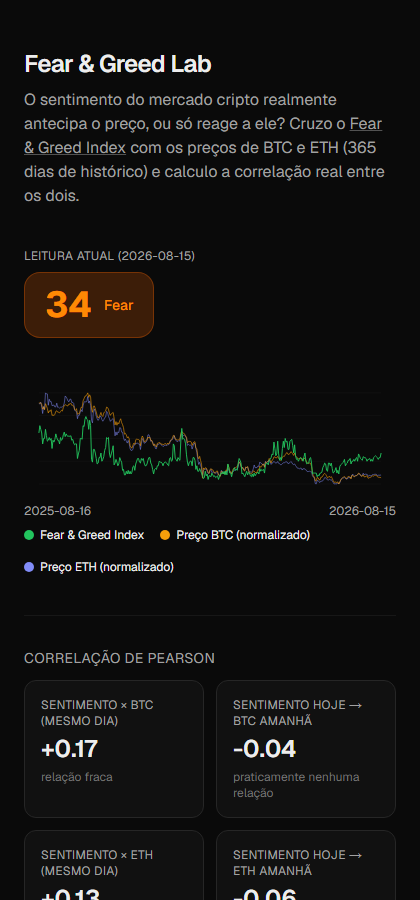

# Fear & Greed Lab

O [Fear & Greed Index](https://alternative.me/crypto/fear-and-greed-index/) é usado por muita
gente como sinal de mercado: "extreme fear" = comprar, "extreme greed" = vender. Mas ele
**realmente** antecipa o preço, ou só reflete o que já aconteceu?

Este projeto ingere diariamente o índice de sentimento e os preços de BTC/ETH, guarda o
histórico e calcula a correlação de Pearson real entre os dois, no mesmo dia e com um dia de
defasagem (sentimento hoje → preço amanhã).



<details>
<summary>Versão mobile</summary>



</details>

## O que os dados mostram (365 dias de histórico)

| Métrica | BTC | ETH |
|---|---|---|
| Sentimento × preço (mesmo dia) | fraca, positiva | fraca, positiva |
| Sentimento hoje → preço amanhã | ~0 (sem poder preditivo) | ~0 (sem poder preditivo) |

Na prática, o índice tende a se mover junto com o preço no mesmo dia (o que faz sentido, já
que ele é parcialmente derivado de volatilidade e momentum), mas não prediz o próximo dia. Os
números exatos mudam a cada ingestão; o dashboard sempre mostra o cálculo atual.

O dashboard também traz:

- **Correlação em janela móvel (30 dias)**: a correlação agregada do ano inteiro esconde se a
  relação muda por regime de mercado. A janela móvel mostra isso dia a dia.
- **Backtest** de uma estratégia simples ("compra no medo extremo, vende na ganância extrema",
  decidida sempre com a leitura do dia anterior para evitar lookahead bias) contra apenas comprar
  e segurar. No período atual, a estratégia perde menos que o buy & hold durante a queda do
  mercado, não porque acerta o timing, mas porque passa parte do tempo fora do mercado.

## Stack

- Next.js 16 (App Router) + TypeScript + Tailwind CSS 4
- Prisma 7 + Postgres (Neon, via driver adapter `@prisma/adapter-pg`)
- Vitest para a lógica de correlação/insights (a parte que realmente precisa estar certa)
- Sem dependências de gráfico (o chart é um SVG simples, sem lib externa)
- Deploy: Vercel, com Vercel Cron chamando a ingestão diária

## Como rodar

```bash
npm install
cp .env.example .env    # aponte DATABASE_URL pra um Postgres (Neon free tier funciona bem)
npx prisma migrate dev
npm run backfill        # popula ~1 ano de histórico (APIs públicas, sem chave)
npm run dev
```

## Ingestão diária em produção

`GET /api/ingest` busca a leitura do dia e faz upsert de uma linha. Em produção, o
[Vercel Cron](https://vercel.com/docs/cron-jobs) configurado em `vercel.json` chama esse
endpoint uma vez por dia (`0 0 * * *`) e envia automaticamente
`Authorization: Bearer <CRON_SECRET>` quando a env var `CRON_SECRET` está definida no projeto.

## Fontes de dados

- [alternative.me](https://alternative.me/crypto/fear-and-greed-index/): Fear & Greed Index (gratuita, sem chave)
- [CoinGecko](https://www.coingecko.com/en/api): preços de BTC/ETH (gratuita, sem chave)

## Aviso

Correlação não é causalidade, e o coeficiente de Pearson não captura relações não-lineares.
Isso é uma exploração de dados, não uma recomendação de investimento.
